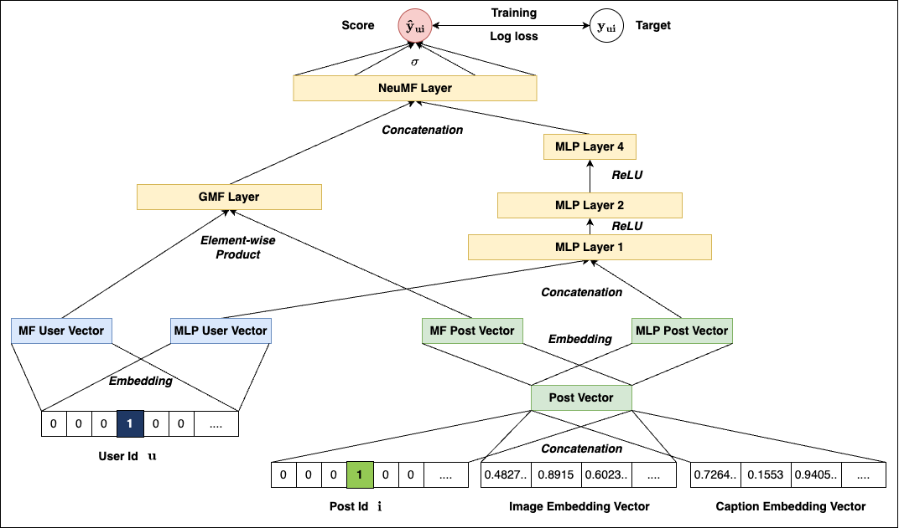
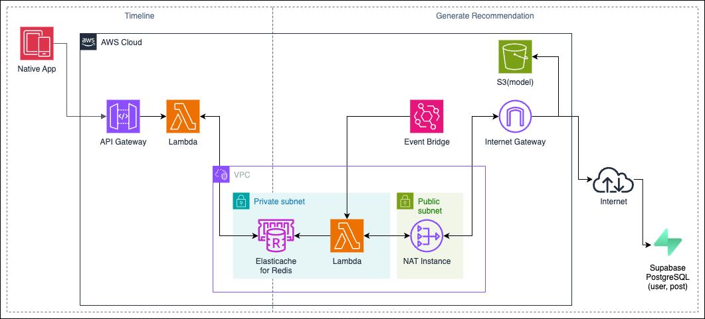

# Animora Recommendation System
<p align="center">
  
</p>

This repository contains the recommendation system developed for  the pet-photo SNS **Animora**. \
This app helps pet owners learn proper care through daily tasks while forming a community with other owners.

This system provides **personalized post recommendations** to users, focusing on both scalability and responsiveness.
Implemented in Python, and optimized for batched inference and caching, the pipeline balances real-time delivery with offline learning.

## Technologies Used
<p style="display: inline">
    
    
    
    
    
    
</p>

## System Overview
The recommender is structured in two phases to handle different scales of user interaction:

### 1. Rule-Based Heuristic (Phase 1)
- Scores posts based on freshness and popularity (likes, comments)

$$\text{Score} = \alpha \times (\text{popularity score}) + (1-\alpha) \times (\text{recency score})$$

- Lightweight logic to bootstrap the system and generate initial interaction data
- Outputs are cached in Redis for fast retrieval

### 2. Neural Collaborative Filtering (Phase 2)
- Trains a NeuCF model using historical interactions (likes, comments) as label and user ID, post ID, post's image embedding, and post's caption embedding as input.

- Scores are calculated offline and cached in Redis

- Handles personalized ranking per user based on learned latent factors

- This implementation refers to the following paper: 
> Xiangnan He, Lizi Liao, Hanwang Zhang, Liqiang Nie, Xia Hu and Tat-Seng Chua (2017). [Neural Collaborative Filtering.](http://dl.acm.org/citation.cfm?id=3052569) In Proceedings of WWW '17, Perth, Australia, April 03-07, 2017.

- **Model Architecture**
<p align="center">
  
</p>


This architecture balances **accuracy** and **latency**, allowing the system to evolve as user data grows.

## System Architecture
<p align="center">
  
</p>


## Repository Structure
```
.
├── __init__.py
├── README.md
├── s01_heuristic
│   ├── database
│   ├── Dockerfile
│   ├── main.py
│   ├── recommender
│   │   ├── __init__.py
│   │   └── heuristic.py
│   └── requirements.txt
├── s02_recsys_neucf
│   ├── database
│   ├── main.py
│   ├── neucf
│   │   ├── __init__.py
│   │   ├── data.py
│   │   ├── engine.py
│   │   ├── metrics.py
│   │   ├── mmneucf.py
│   │   └── utils.py
│   ├── recommender
│   │   ├── __init__.py
│   │   ├── heuristic_rec.py
│   │   └── neucf_rec.py
│   └── utils
├── s02_train_neucf
│   ├── database
│   ├── main.py
│   ├── neucf
│   │   ├── __init__.py
│   │   ├── data.py
│   │   ├── engine.py
│   │   ├── metrics.py
│   │   ├── mmneucf.py
│   │   └── utils.py
│   └── utils
└── timeline
    ├── database
    ├── Dockerfile
    ├── main.py
    ├── recommender
    │   └── recommender.py
    └── requirements.txt
```